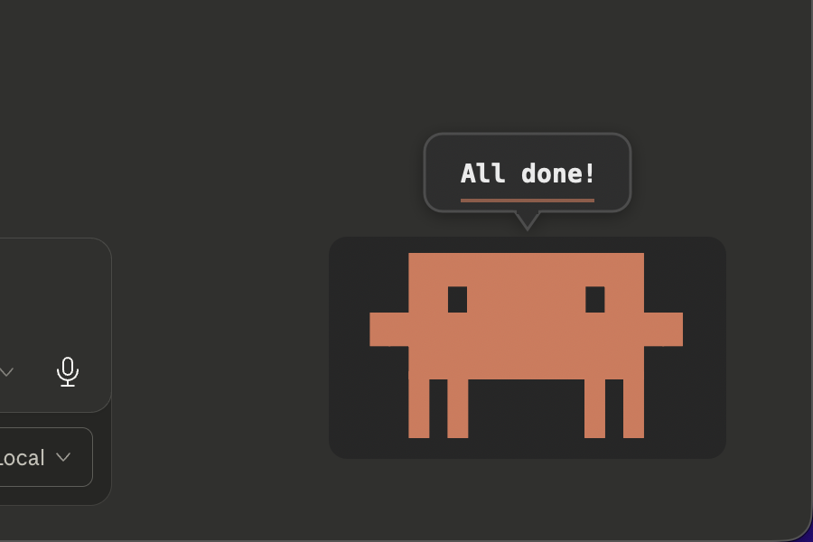
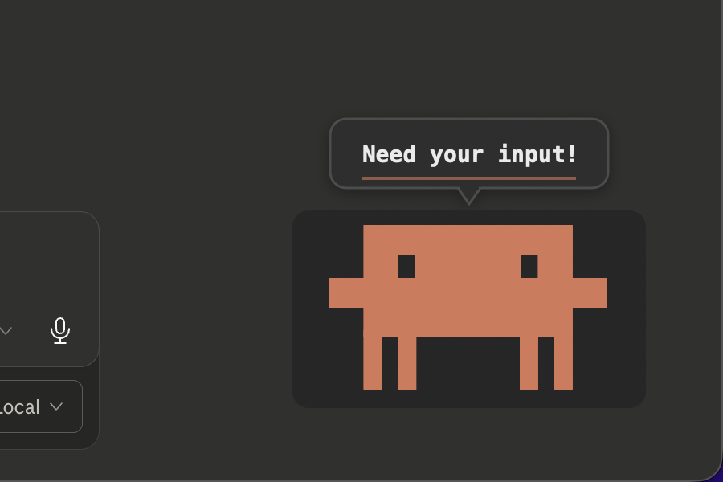

# cc-notify

Clippy-style desktop notifications for [Claude Code](https://docs.anthropic.com/en/docs/claude-code), featuring the Clawd mascot. Get a friendly pop-up whenever Claude finishes a task or needs your attention.


<p align="center">
  
  &nbsp;&nbsp;
  
</p>

<p align="center">
  <em>Left: task complete notification (green accent) · Right: needs input notification (orange accent)</em>
</p>

## Features

- **Clawd overlay notifications** — A borderless, click-through overlay appears in the bottom-right corner of your screen with an animated Clawd character and speech bubble
- **Two notification styles** — "Done" (green, happy Clawd) when a task finishes, "Attention" (orange, alert Clawd) when Claude needs input
- **Smooth animations** — Entrance bounce, idle bobbing, and fade-out exit over a 4.4-second cycle
- **Claude Code hook integration** — One-command install into Claude Code's hook system
- **Works everywhere** — Appears above all windows, across all Spaces and full-screen apps

## Requirements

- macOS 13.0 (Ventura) or later
- Apple Silicon or Intel Mac
- [Claude Code](https://docs.anthropic.com/en/docs/claude-code) (for hook integration)

## Installation

### Option A: Download the pre-built binary (quickest)

1. Go to the [latest release](https://github.com/0pilatos0/cc-notify/releases/latest) page
2. Download the `cc-notify-macos-arm64` binary
3. Open Terminal and run:

```bash
# Make the binary executable
chmod +x ~/Downloads/cc-notify-macos-arm64

# Move it to your PATH (requires admin password)
sudo mv ~/Downloads/cc-notify-macos-arm64 /usr/local/bin/cc-notify
```

4. Verify it works:

```bash
cc-notify --version
# cc-notify 1.0.0
```

> **Note:** If macOS shows a security warning ("cannot be opened because the developer cannot be verified"), go to **System Settings > Privacy & Security** and click **Allow Anyway**, then run the command again.

### Option B: Build from source

Requires **Xcode** or **Swift 5.9+** command-line tools.

```bash
# Clone the repository
git clone https://github.com/0pilatos0/cc-notify.git
cd cc-notify

# Build in release mode
swift build -c release

# Install to your PATH
sudo cp .build/release/cc-notify /usr/local/bin/

# Verify
cc-notify --version
```

## Setup — Connect to Claude Code

cc-notify works by hooking into Claude Code's event system. The `install` command registers it automatically:

```bash
cc-notify install
```

You should see:

```
Installed cc-notify hooks in ~/.claude/settings.json
  Stop → /usr/local/bin/cc-notify show --event stop
  Notification → /usr/local/bin/cc-notify show --event notification

Run 'cc-notify show --event stop' to test it!
```

**That's it!** From now on, every time Claude Code finishes a task or needs your input, Clawd will pop up in the corner of your screen.

### Test it

Run this to see the notification right away:

```bash
cc-notify show --event stop
```

### Uninstall hooks

To remove cc-notify from Claude Code (the binary stays installed):

```bash
cc-notify uninstall
```

### What the install does

The `install` command adds two entries to `~/.claude/settings.json`:

| Hook Event     | When it fires                           | Notification Style       |
|----------------|-----------------------------------------|--------------------------|
| `Stop`         | Claude Code finishes a task             | Green "Done" (happy Clawd) |
| `Notification` | Claude Code needs your attention/input  | Orange "Attention" (alert Clawd) |

## Usage

Once installed, cc-notify runs automatically — no action needed. You can also trigger notifications manually:

```bash
# "Done" notification (default)
cc-notify show --event stop

# "Attention" notification
cc-notify show --event notification

# Custom message
cc-notify show --event stop --message "Build succeeded!"
```

### CLI Reference

```
USAGE: cc-notify <subcommand>

SUBCOMMANDS:
  show (default)    Display a Clawd notification overlay
  install           Configure Claude Code hooks for cc-notify
  uninstall         Remove cc-notify hooks from Claude Code settings
```

#### `cc-notify show`

| Option      | Description                          | Default          |
|-------------|--------------------------------------|------------------|
| `--event`   | Event type: `stop` or `notification` | `stop`           |
| `--message` | Custom message text                  | Random from pool |

#### `cc-notify install`

| Option          | Description                              | Default       |
|-----------------|------------------------------------------|---------------|
| `--binary-path` | Path to the cc-notify binary             | Auto-detected |

## How it works

1. Claude Code fires a hook event (e.g., `Stop` when a task finishes)
2. Claude Code runs `cc-notify show --event stop` and pipes the event JSON to stdin
3. cc-notify reads the event, picks the notification style and message
4. A transparent, borderless macOS overlay window appears in the bottom-right corner
5. Clawd animates in (bounce), idles for ~3.5 seconds (gentle bobbing), then fades out
6. Total display time: ~4.4 seconds — fully automatic, no interaction needed

The overlay is click-through (doesn't steal focus), appears on all Spaces and full-screen apps, and renders at `NSWindow.Level.statusBar` so it floats above most windows.

## Troubleshooting

**Notification doesn't appear?**
- Make sure `cc-notify` is in your PATH: `which cc-notify`
- Test manually: `cc-notify show --event stop`
- Check hooks are installed: `cat ~/.claude/settings.json | grep cc-notify`

**"Cannot be opened because the developer cannot be verified"**
- Go to **System Settings > Privacy & Security**, scroll down, and click **Allow Anyway**

**Want to change the notification duration or position?**
- These are currently hardcoded. Fork the repo and edit `AnimationController.swift` and `OverlayWindow.swift`.

## License

[MIT](LICENSE)
